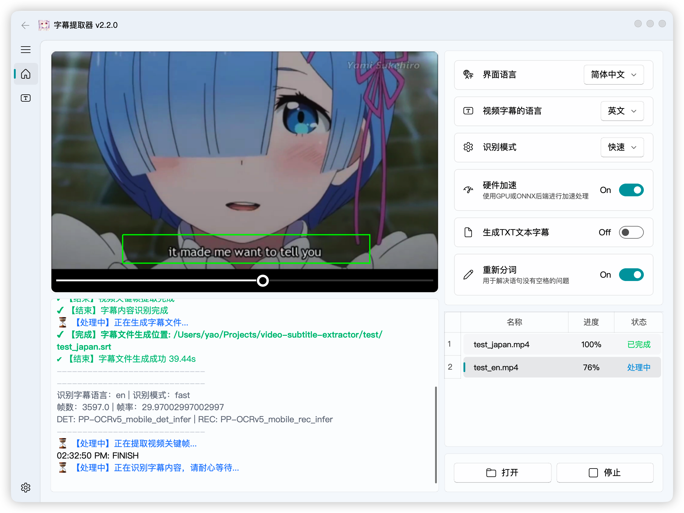

简体中文 | [English](README_en.md)

## 项目简介


  

Video-subtitle-extractor (VSE) 是一款将视频中的硬字幕提取为外挂字幕文件(srt格式)的软件
主要实现了以下功能：

- 提取视频中的关键帧
- 检测视频帧中文本的所在位置
- 识别视频帧中文本的内容
- 过滤非字幕区域的文本
- [去除水印、台标文本、原视频硬字幕，可配合：video-subtitle-remover (VSR) ](https://github.com/YaoFANGUK/video-subtitle-remover/tree/main)
- 去除重复字幕行，生成srt字幕文件/txt文本文件
- 支持视频字幕**批量提取**
- 多语言：支持**简体中文（中英双语）**、**繁体中文**、**英文**、**日语**、**韩语**、**越南语**、**阿拉伯语**、**法语**、**德语**、**俄语**、**西班牙语**、**葡萄牙语**、**意大利语**等**87种**语言的字幕提取
- 多模式：
  - **快速**：（推荐）使用轻量模型，快速提取字幕，可能丢少量字幕、存在少量错别字
  - **自动**：（推荐）自动判断模型，CPU下使用轻量模型；GPU下使用精准模型，提取字幕速度较慢，可能丢少量字幕、几乎不存在错别字
  - **精准**：（不推荐）使用精准模型，GPU下逐帧检测，不丢字幕，几乎不存在错别字，但速度**非常慢**

> 请优先使用快速/自动模式，如果前两种模式存在较多丢字幕轴情况时，再使用精准模式
 
<p style="text-align:center;"></p>

**项目特色**：

- 采用本地进行OCR识别，无需设置调用任何API，不需要接入百度、阿里等在线OCR服务即可本地完成文本识别
- 支持GPU加速，GPU加速后可以获得更高的准确率与更快的提取速度

**使用说明**：

- 有使用问题请加群讨论，QQ群：210150985（已满）、806152575（已满）、816881808（已满）、295894827

- 点击【打开】后选择视频文件，调整字幕区域，点击【运行】
  - 单文件提取：打开文件的时候选择**单个**视频
  - **批量提取**：打开文件的时候选择**多个**视频，确保每个视频的分辨率、字幕区域保持一致

- 去除水印文本/替换特定文本：
> 如果视频中出现特定的文本需要删除，或者特定的文本需要替换，可以编辑 ``backend/configs/typoMap.json``文件，加入你要替换或去除的内容

```json
{
	"l'm": "I'm",
	"l just": "I just",
	"Let'sqo": "Let's go",
	"Iife": "life",
	"威筋": "威胁",
  	"性感荷官在线发牌": ""
}
```

> 这样就可以把文本中出现的所有“威筋”替换为“威胁”，所有的“性感荷官在线发牌”文本删除

- 视频以及程序路径请**不要带中文和空格**，否则可能出现未知错误！！！

 > 如：以下存放视频和代码的路径都不行
 >
 > D:\下载\vse\运行程序.exe（路径含中文）
 >
 > E:\study\kaoyan\sanshang youya.mp4 （路径含空格） 

- 直接下载压缩包解压运行，如果不能运行再按照下面的教程，尝试源码安装conda环境运行

**下载地址**：<a href="https://github.com/YaoFANGUK/video-subtitle-extractor/releases"> Release </a>

> **有任何改进意见请在ISSUES和DISCUSSION中提出**

> NVIDIA官方提供了各GPU型号的计算能力列表，您可以参考链接: [CUDA GPUs](https://developer.nvidia.com/cuda-gpus) 查看你的GPU适合哪个CUDA版本

> NVIDIA 50系显卡需要使用cuda12.8.0及以上版本, 但Paddle3.3.1目前仍未支持，所以建议使用Directml通用版本

**识别模式选择说明**：
|    模式名称    | GPU | OCR模型尺寸 | 字幕检测引擎 | 备注 |
|---------------|-----|---------|------|------|
|    快速        | 有/无 | 迷你  | VideoSubFinder | |
|    自动  | 有| 大  | VideoSubFinder |  推荐   |
|    自动  | 无| 迷你  | VideoSubFinder |  推荐   |
|    精准        | 有/无| 大  | VSE | 非常慢 |
> Windows/Linux/MacOS环境下字幕检测引擎都是VideoSubFinder

## 演示

- GUI版：[点击查看GPU版本源码运行的安装教程 👈](https://www.bilibili.com/video/bv11L4y1Y7Tj)

<p style="text-align:center;"></p>


## 源码使用说明

#### 1. 安装 Python

请确保您已经安装了 Python 3.12+

- Windows 用户可以前往 [Python 官网](https://www.python.org/downloads/windows/) 下载并安装 Python
- MacOS 用户可以使用 Homebrew 安装：
  ```shell
  brew install python@3.12
  ```
- Linux 用户可以使用包管理器安装，例如 Ubuntu/Debian：
  ```shell
  sudo apt update && sudo apt install python3.12 python3.12-venv python3.12-dev
  ```

#### 2. 安装依赖文件

请使用虚拟环境来管理项目依赖，避免与系统环境冲突

（1）创建虚拟环境并激活
```shell
python -m venv videoEnv
```

- Windows：
```shell
videoEnv\\Scripts\\activate
```
- MacOS/Linux：
```shell
source videoEnv/bin/activate
```

#### 3. 创建并激活项目目录

切换到源码所在目录：
```shell
cd <源码所在目录>
```
> 例如：如果您的源代码放在 D 盘的 tools 文件夹下，并且源代码的文件夹名为 video-subtitle-extractor，则输入：
> ```shell
> cd D:/tools/video-subtitle-extractor-main
> ```

#### 4. 安装合适的运行环境

本项目支持 CUDA（NVIDIA显卡加速）、CPU（无 GPU）、DirectML（AMD、Intel等GPU/APU加速）、ONNX四种运行模式

##### (1) CUDA（NVIDIA 显卡用户）

> 请确保您的 NVIDIA 显卡驱动支持所选 CUDA 版本

- 推荐 CUDA 11.8，对应 cuDNN 8.6.0

- 安装 CUDA：
  - Windows：[CUDA 11.8 下载](https://developer.download.nvidia.com/compute/cuda/11.8.0/local_installers/cuda_11.8.0_522.06_windows.exe)
  - Linux：
    ```shell
    wget https://developer.download.nvidia.com/compute/cuda/11.8.0/local_installers/cuda_11.8.0_520.61.05_linux.run
    sudo sh cuda_11.8.0_520.61.05_linux.run
    ```
  - MacOS 不支持 CUDA

- 安装 cuDNN（CUDA 11.8 对应 cuDNN 8.6.0）：
  - [Windows cuDNN 8.6.0 下载](https://developer.download.nvidia.cn/compute/redist/cudnn/v8.6.0/local_installers/11.8/cudnn-windows-x86_64-8.6.0.163_cuda11-archive.zip)
  - [Linux cuDNN 8.6.0 下载](https://developer.download.nvidia.cn/compute/redist/cudnn/v8.6.0/local_installers/11.8/cudnn-linux-x86_64-8.6.0.163_cuda11-archive.tar.xz)
  - 安装方法请参考 NVIDIA 官方文档

- 安装 PaddlePaddle GPU 版本（CUDA 11.8）：
  ```shell
  pip install paddlepaddle-gpu==3.3.1 -i https://www.paddlepaddle.org.cn/packages/stable/cu118/
  pip install -r requirements.txt
  ```

##### (2) DirectML（AMD、Intel等GPU/APU加速卡用户）

- 适用于 Windows 设备的 AMD/NVIDIA/Intel GPU
- 安装 ONNX Runtime DirectML 版本：
  ```shell
  pip install paddlepaddle==3.3.1 -i https://www.paddlepaddle.org.cn/packages/stable/cpu/
  pip install -r requirements.txt
  pip install -r requirements_directml.txt
  ```

##### (3) ONNX (适合macOS、AMD ROCm等环境加速用户, 基础环境与DirectML方式一致，未测试！)

- 使用这个方式部署请勿反馈Issues
- 适用于 Linux 或 macOS 设备的 AMD/Metal GPU/Apple Silicon GPU
- 安装 ONNX Runtime DirectML 版本：
  ```shell
  pip install paddlepaddle==3.3.1 -i https://www.paddlepaddle.org.cn/packages/stable/cpu/
  pip install -r requirements.txt

  # 阅读文档 https://onnxruntime.ai/docs/execution-providers/
  # 根据你的设备选择合适的执行后端, 参考requirements_directml.txt文件修改成合适你环境的依赖

  # 例如:
  # requirements_coreml.txt
  #   paddle2onnx==1.3.1
  #   onnxruntime-coreml==1.13.1

  pip install -r requirements_coreml.txt
  ```

##### (4) CPU 运行（无 GPU 加速）

- 适用于没有 GPU 或不希望使用 GPU 的情况
- 直接安装 CPU 版本 PaddlePaddle：
  ```shell
  pip install paddlepaddle==3.3.1 -i https://www.paddlepaddle.org.cn/packages/stable/cpu/
  pip install -r requirements.txt
  ```

#### 5. 运行程序

- 运行图形化界面版本（GUI）

```shell
python gui.py
```

- 运行命令行版本（CLI）

```shell
python ./backend/main.py
```

## 常见问题与解决方案

#### 1. 运行不正常/没有结果/cuda及cudnn问题

解决方案：根据自己的显卡型号、显卡驱动版本，安装对应的cuda与cudnn

#### 2. 7z文件解压错误

解决方案：升级7-zip解压程序到最新版本

## 赞助


